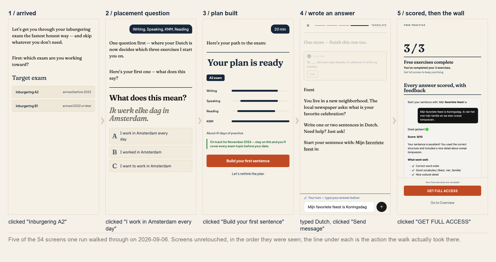
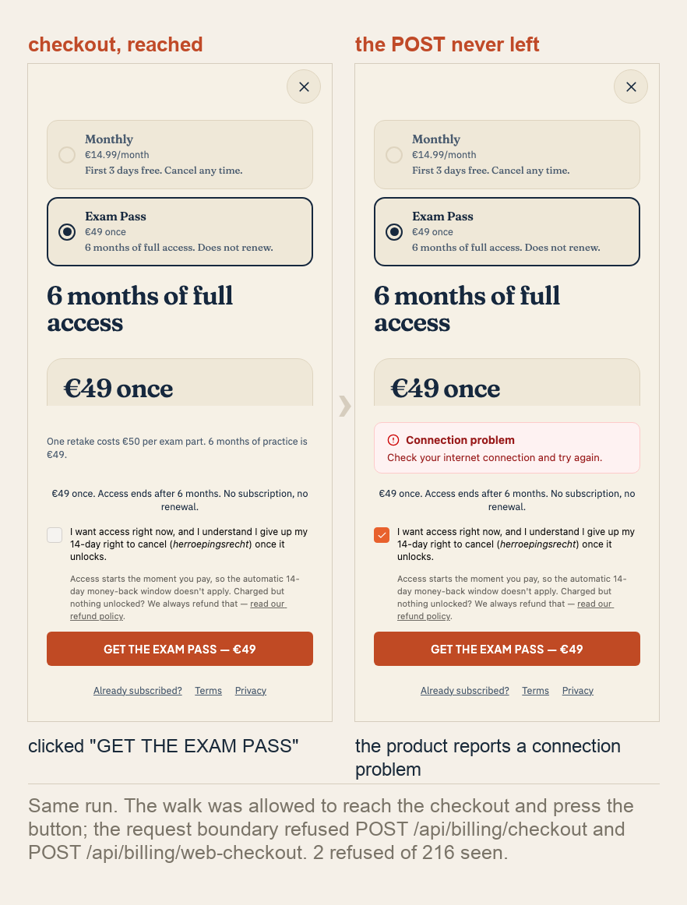

# releashed

Point it at a deployed web product. It walks that product the way a person would, looking at the
screen and deciding the next thing to try in plain English, and comes back with a map of every
screen it saw and every transition it actually observed, each one backed by a screenshot.

No source code, no database, no test ids, no list of journeys to follow.



Those are five of the 54 screens from one real run, in the order they were seen. The screenshots are
unretouched and the action under each one is copied out of that run's `map.json`; only the numbering
is written by hand. Nobody sat at a browser. The product is the author's own, which is why its
signed-in screens are here at all.

## The command that produced it

```sh
releashed login https://app.inburgering.coach          # a human signs in once, by hand
releashed map  https://app.inburgering.coach --login --mine --model opus --steps 60
```

It ran for 8 minutes of browser time, took 60 actions, and cost EUR 0.53 on Opus. It wrote 54
screens, 54 transitions and 11 named flows into a candidate directory, along with every screenshot
above.

## It reached the checkout and could not pay



The walk was allowed to press the button. The request boundary underneath refused
`POST /api/billing/checkout` and `POST /api/billing/web-checkout` before they left the browser, so
the product showed a network error and no money moved. Two refusals out of 216 requests the boundary
saw, all of it written into `metrics.json` and `request-events.jsonl`. That is the shape of every
promise below: a refusal you can read in the evidence, not a policy in a prompt.

Another real map, rendered: https://releashed.io/m/e78f288edb489316/flow-map.html

<!-- KEYS: the single place this document states what an API-driven run needs. If the key
     requirement changes, change it here and nowhere else. -->

## What it needs

**Node 22 or newer, Chromium, and two API keys of yours:**

```sh
export ANTHROPIC_API_KEY=...   # decides what to try next, from the screenshot
export GEMINI_API_KEY=...      # points at the control the explorer named
```

Only `releashed map` spends. A 60-step map costs roughly EUR 0.50 on Sonnet or EUR 1.00 on Opus, on
your key, plus a fraction of a cent for the pointing. Every run prints its own estimate before it
starts and `--budget` caps it. `releashed doctor` checks your Node version, both keys and Chromium
before you spend, and `releashed map` refuses to start until all four are in place, naming each one.

Two keys is one too many and we know it. Captions stopped needing the second key: they ride on your
Anthropic key now. Grounding still needs it, and the blocker there is the library, not the model.
Anthropic's own model points at a control accurately (8 of 8 controls on a small probe, every one
inside the real element), but it did that through a direct Anthropic call, and the
browser-automation library we ground through accepts only its own listed model families, none of
which is Anthropic's. We would rather ask for a second key than pretend one model is doing both
jobs. If you already have some other vision key, `MIDSCENE_MODEL_API_KEY` with `MIDSCENE_MODEL_NAME`,
`MIDSCENE_MODEL_FAMILY` and `MIDSCENE_MODEL_BASE_URL` points the grounding step wherever you like.

Two ways to need neither key: `releashed explore-mcp` hands the walk to your own coding agent over
MCP, and `releashed memory` reads captures you already have, with no browser, no sign-in and no
model call. Either key can also be pointed elsewhere: `SPIKE_EXPLORER_BASE_URL` with
`SPIKE_EXPLORER_API_KEY` routes the explorer at any OpenAI-compatible host, and `CAPTION_BASE_URL`
with `CAPTION_API_KEY` does the same for captions. Each pair is all or nothing.

<!-- END KEYS -->

## Install

```sh
npm install -g github:pooyahrtn/releashed-cli
releashed install-browser
```

Not on npm yet. The `releashed` and `releashed-cli` names are reserved there and the packages behind
them are placeholders, so `npx releashed` does not work: install from the repository until a real
version is published.

<details>
<summary>Installing from a release checkout instead</summary>

`npm pack` builds the archive. Install it from **outside** the checkout, because installing in place
makes npm resolve against the developer `node_modules` instead of the archive's own dependencies:

```sh
mkdir -p /tmp/releashed-install && cp releashed-0.1.0.tgz /tmp/releashed-install/
npm install -g /tmp/releashed-install/releashed-0.1.0.tgz
releashed install-browser
```

</details>

Then, from the product repository, let it install its agent skills:

```sh
releashed install-skills          # writes .claude/skills; --destination for elsewhere
```

Existing skill folders are left alone; `--replace` overwrites one deliberately.

The skills are the point. **The reader of this tool is a coding agent as much as a person.** Your
agent reads them and drives the rest: `releashed-capture` to answer "show me flow X",
`releashed-memory` for saved evidence only, `releashed-setup` to sign a walk in, `releashed-explore`
to map a product it knows nothing about.

## The commands

`releashed --help` documents every flag. In short:

| | |
|---|---|
| `map <url>` | Explore and write a map, on model keys. `--goal` aims it at one flow. |
| `explore-mcp [<url>]` | Same walk, same boundary, but your coding agent is the explorer. |
| `memory <url> --goal "<English>"` | Search sealed local captures. Read-only: no browser, no sign-in, no model call. |
| `notes <url> --goal "<English>"` | Consult evidence-backed flow notes remembered about this product. |
| `mcp [candidate-dir]` | Serve a finished map to your agent (6 tools), or shared capture memory (3 tools). |
| `diff <old-map-dir> <new-map-dir>` | What changed between two maps. Exit 1 if something that existed is gone. |
| `login <url>` | Open a browser so you sign in by hand; the session is saved for `--login`. |
| `doctor` / `install-browser` / `install-skills` | Setup and preflight. |
| `select` / `remember` / `report` / `phases` | Used by the packaged skills while completing a capture. |

Everything lands in the product's shared Git store (`.git/releashed`), so every worktree finds the
same sealed captures. Outside Git it falls back to `./releashed`; `RELEASHED_OUT` overrides either.
Nothing is uploaded and nothing phones home: **no telemetry, at all.**

### Signing in without a human

`releashed login` opens a visible browser so **you** log in by hand; cookies are saved on your
machine, mode 600. We never see a password.

For a product you own, `--auth-cmd` removes the human entirely. If your backend can mint a one-shot
sign-in link for a test account (a Clerk ticket, a magic link, a signed redirect), point us at the
command that prints one:

```sh
releashed map https://app.example.com/home --mine \
  --auth-cmd "bun scripts/mint-sign-in.ts qa-persona"
```

The command must print either a sign-in URL or a session file of the same shape `releashed login`
writes. The run proceeds exactly as `--login` does, and still refuses to explore if the landing page
is a sign-in page. Use it only for a product you own, never for someone else's credentials.

### Asking for one flow

A directed run (`--goal`) pursues one screen instead of roaming, stops when it is looking at it, and
its map is labelled as directed: never evidence that a screen is discoverable, never a diff baseline
against a free walk. A walker saying it arrived produces `goal_claimed` with its reason and the
screenshot it was looking at, which is a claim to inspect, not verification.

A run that does **not** reach its goal searches what you already captured, in your own words, and
names the candidates with their dates. So an aimed run that falls short still answers the question
when an earlier run already did. These are candidates to inspect, not proof, and the dates are there
because only you can judge whether a screen from last week still counts. It reports what is in the
store; it never tells you your product lacks a screen.

## What it will not do

- **It will not get past a wall.** A bot check ends the run and is written into the map as a
  finding; a login wall at the front door does the same, and tells you to use `releashed login`.
  There is no user-agent trick, no proxy, no back door.
- **It will not sign up or log in for you**, and it will not invent a value to get past a form. It
  types only what `--seed` gave it; anything else that looks like an email address, a phone number
  or a password is refused.
- **It will not send, post, pay or delete on a stranger's product.** Those verbs are refused before
  the click, and the request boundary underneath refuses every mutating request to the product's own
  origin anyway. **With `--mine`** (you own this product), ordinary product use is allowed, such as
  submitting an answer or posting a reply. It still never pays or deletes, and still refuses
  anything billing-, checkout-, subscription- or account-deletion-shaped, however the instruction
  words it. The second image above is that refusal happening.
- **It will not leave the product.** One origin (plus any you `--allow`), inside your path globs.
  Off-site links are noted as doors not taken.
- **It will not keep your data.** Contact details are redacted out of the retained text **at capture
  time**, before anything is hashed, and the packager refuses to seal a candidate carrying anything
  credential- or PII-shaped. Screenshots still show whatever the page showed; pixel blurring is not
  in this version, so look before you share a map of a product with real data on screen.
- **It is not a test runner and not a pixel-diff tool.** Two runs explore differently, so a map is
  what was seen this time. `diff` compares two maps by screen, not by pixel, and is loud when a
  product serves different copy on different days. The evidence contract refuses to draw a
  transition nothing observed, so a bad run gives you a thin map, never a false one.
- **It does not promise complete coverage.** Nothing that walks a product from the outside can. What
  it did not reach is absent, and `map.json`'s findings say why.

## What comes out

A candidate directory, every file hashed into `manifest.json`:

```
map.html                     the map, standalone, screenshots embedded
map.json                     the same graph as data, documented in docs/map-schema.md
observations.jsonl           one line per observed transition: before, after, what was clicked
screenshots/                 every retained screen, at most 1280px wide
public-pack.json             what the product's own landing page says about itself, quoted
metrics.json                 tokens, cost in EUR, every request the boundary saw
production-run-report.json   how the run ended
```

## Licence and status

MIT. **Early, and honestly so: no users yet.** The CLI and the MCP servers work and the maps above
are real. The grounder swap has not landed and nothing hosted exists. Issues and pull requests
welcome, and so is a note saying you tried it.

Built in the open: this repository is also the lab it was made in. [AGENTS.md](AGENTS.md) is how the
lab works.
